<h1 align="center">
  Hiii folks, Welcome to my github!
  
</h1>

<a href="[https://myoctocat.dev/@sw-yx/octocat](https://user-images.githubusercontent.com/52084984/200451932-62876bf0-1b83-4730-8516-a2fc84efb3cd.gif)" style="margin: 10px">
  
</a>

<br>
<br>

- 🖥️ Computer Engineer graduated from University of Vigo - ESEI.
- 💼 Software Developer at ALIA Technologies and Advisor at Auria Technologies.
- 🌐 Portfolio: **[javipena.vercel.app](https://javipena.vercel.app)**
- 🔐 Currently learning cybersecurity.
- 📚 Native Spanish and Galician speaker. I also speak English and a little Turkish.
- ✈︎🌍 Erasmus at İstanbul Aydın University (2024-2025).


<br>
<br>

### <picture></picture> aboutMe.js


```javascript
const Javi = {
    code: ["JavaScript", "TypeScript", "C", "C++", "Java", "PHP", "HTML", "CSS", "SCSS", "Python", "Bash",
           "JSON", "SQL", "MongoDB", "MySQL", "Oracle", "R Commander", "Dockerfile", "Docker Compose"],
    icouldTalkForHoursAbout: ["technology", "cybersecurity", "formula1", "music", "movies", "games", "food"],
    technologies: {
        frontEnd: {
            js: ["React Native", "Expo", "Redux", "jQuery"],
            ts: ["Angular", "Vue", "Nuxt"],
            css: ["Bootstrap", "FontAwesome", "Tailwind"],
            design: ["Figma"],
        },
        backEnd: {
            ts: ["Node.js", "LoopBack"],
            apis: ["REST", "Swagger", "Postman", "NATS"],
            sql: ["MySQL", "Oracle", "MongoDB", "Mongo Compass", "DBeaver", "phpMyAdmin"],
            cache: ["Redis"],
        },
        erp: ["Odoo", "Odoo API", "PrestaShop"],
        devOps: ["Docker", "Docker Compose", "Portainer", "Git", "GitFlow", "GitHub", "GitLab", "CI/CD",
                 "SonarQube", "DigitalOcean", "Apache", "Linux"],
        ai: ["Anthropic Claude", "Claude Skills", "Prompt Engineering", "Spec-driven development",
             "SpecKit", "OpenSpec", "Machine Learning"],
        networking: ["Wireshark", "Packet Tracer"],
    },
};
```

<br>
<br>

<div align="center">
  <p>
  
  </p>
  <p>
    
  </p>
</div>

<br>
<br>


---

### 🔗 Contact 

<a href="https://javipena.vercel.app" target="_blank">
    
</a>

<a href="https://linkedin.com/in/javier-pena-bello-1a437527a/" target="_blank">
    
</a>
  
<a href="mailto:davidpenassss@gmail.com" target="_blank">
  
</a>

---

<!-- Generated daily by .github/workflows/snake.yml into the "output" branch -->
<p align="center">
  <picture>
    <source media="(prefers-color-scheme: dark)" srcset="https://raw.githubusercontent.com/Whuaxu/Whuaxu/output/github-snake-dark.svg" />
    <source media="(prefers-color-scheme: light)" srcset="https://raw.githubusercontent.com/Whuaxu/Whuaxu/output/github-snake.svg" />
    
  </picture>
</p>


